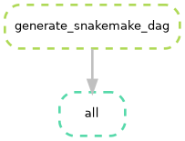

# Salmonella biofilm formation prediction

## Workflow DAG

## Running the pipeline

* Edit the config file in the indicated places
* Install `snakemake`. A bare conda/mamba environment is recommended (ie., created with `mamba craete -c conda-forge -c bioconda -n snakemake snakemake`)
* Run the pipeline with `snakemake --use-conda -c`

## To Dos

- [ ] Parameterize k for k-mer counting
- [ ] Add AA k-mer counting
- [ ] Feature selection
- [ ] Configure for slurm
- [ ] Update XGBoost version to avoid deprecation warnings
    - See: https://github.com/dmlc/xgboost/issues/9543
- [ ] Phylogenetic tree building
- [ ] Containerization
- [ ] More instrutions on running the pipeline
